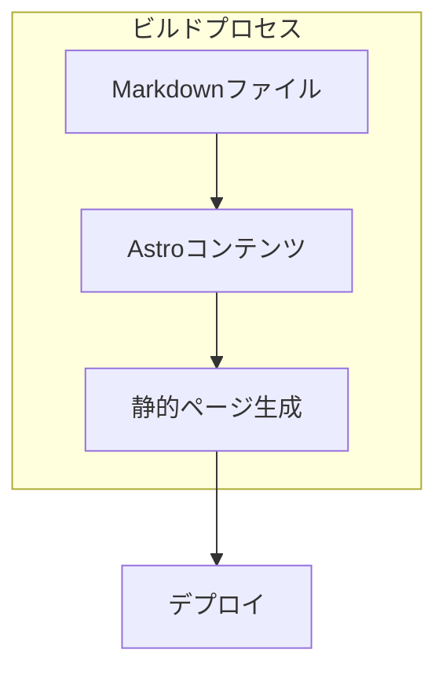

# システムパターン

## アーキテクチャ概要
- Astroベースの静的サイトジェネレーター
- ファイルベースのルーティング
- Markdownコンテンツ管理
- コンポーネントベースの設計

## 主要コンポーネント
1. ページコンポーネント
   - インデックスページ（/pages/index.astro）
   - ブログ記事ページ（/pages/blog/[...slug].astro）
   - アバウトページ（/pages/about.astro）

2. レイアウトコンポーネント
   - ベースレイアウト
   - ブログ記事レイアウト
   - 共通ヘッダー/フッター

3. ユーティリティ機能
   - 日付フォーマット
   - メタデータ管理
   - RSS生成

## データフロー

## 設計パターン
1. ファイルベースルーティング
   - URLstructureがディレクトリ構造と一致
   - 動的ルーティングの活用

2. コンポーネント分割
   - 再利用可能なUI部品
   - 責務の明確な分離
   - プロップスによるデータ受け渡し

3. コンテンツ管理
   - Markdownベースの記事管理
   - フロントマターによるメタデータ制御
   - 画像アセットの最適化

## 技術的制約
- 静的サイト生成による制限
- ビルド時のパフォーマンス考慮
- アセット最適化の必要性
