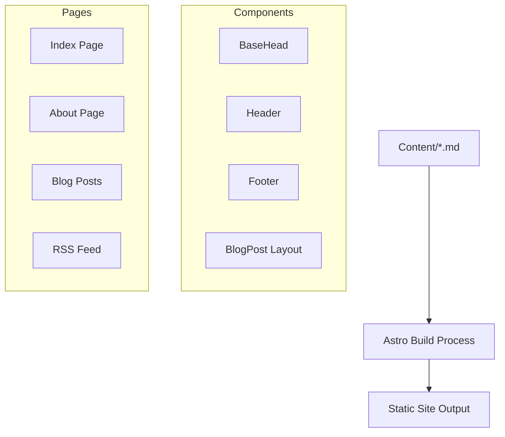

# System Patterns: Technical Blog Platform

## Architecture Overview



## Directory Structure
```
blog/
├── public/          # Static assets
├── src/
│   ├── components/  # Reusable UI components
│   ├── content/     # Blog posts and content
│   ├── layouts/     # Page layouts
│   ├── pages/       # Route pages
│   ├── styles/      # Global styles
│   └── utils/       # Utility functions
```

## Key Design Patterns

### Content Management
- Content Collections pattern for blog posts
- Markdown files with frontmatter for metadata
- Static asset organization in public directory
- Type-safe content schemas

### Component Architecture
- Atomic design principles
- Reusable component structure
- Layout composition pattern
- Type-safe props

### Routing & Navigation
- File-based routing
- Static path generation
- SEO-optimized URLs
- RSS feed generation

## Technical Decisions

### Framework Choice: Astro
- Optimal for content-heavy sites
- Zero JavaScript by default
- Component island architecture
- Built-in Markdown support

### Development Tools
- TypeScript for type safety
- ESLint for code quality
- Prettier for formatting
- Built-in dev server

### Performance Patterns
- Static site generation
- Optimized asset loading
- Minimal client-side JavaScript
- Image optimization

## Implementation Guidelines

### Content Structure
```typescript
interface BlogPost {
  title: string;
  description: string;
  pubDate: Date;
  updatedDate?: Date;
  heroImage?: string;
  categories?: string[];
}
```

### Component Patterns
- Common props interfaces
- Consistent naming conventions
- Shared styling patterns
- Component composition rules

### Build & Deploy
- Static site generation
- Asset optimization
- Cache strategies
- Deploy previews

## System Constraints
- Content must be in Markdown
- Images stored in public directory
- TypeScript strict mode enabled
- ESLint rules compliance
