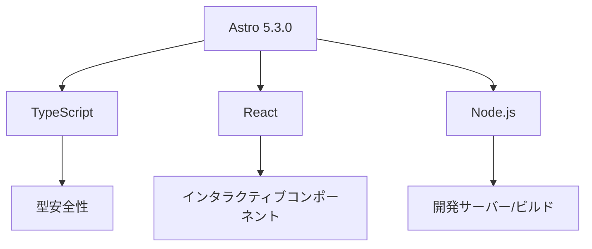

# 技術コンテキスト

## 開発環境
- Node.js v22
- Visual Studio Code
- ESLint & Prettier
- Git & GitHub

## 主要技術スタック

## フレームワーク・ライブラリ
1. Astro 5.3.0
   - 静的サイト生成
   - パフォーマンス最適化
   - コンポーネントアイランド

2. TypeScript
   - 型安全性の確保
   - 開発効率の向上
   - コード品質の維持

3. React (Astro内で使用)
   - インタラクティブコンポーネント
   - 状態管理
   - UIライブラリ統合

## 開発ツール
1. リンター/フォーマッター
   - ESLint: コード品質チェック
   - Prettier: コードフォーマット
   - textlint: 文章校正

2. バージョン管理
   - Git
   - GitHub

3. パッケージ管理
   - npm
   - package.json による依存関係管理

## ビルド・デプロイ
1. ビルドプロセス
   - Astroビルドシステム
   - アセット最適化
   - バンドル生成

2. 開発サーバー
   - ホットリロード
   - 開発者ツール
   - デバッグ機能

## パフォーマンス最適化
- 画像最適化
- コードスプリッティング
- キャッシュ戦略
- レンダリング最適化
